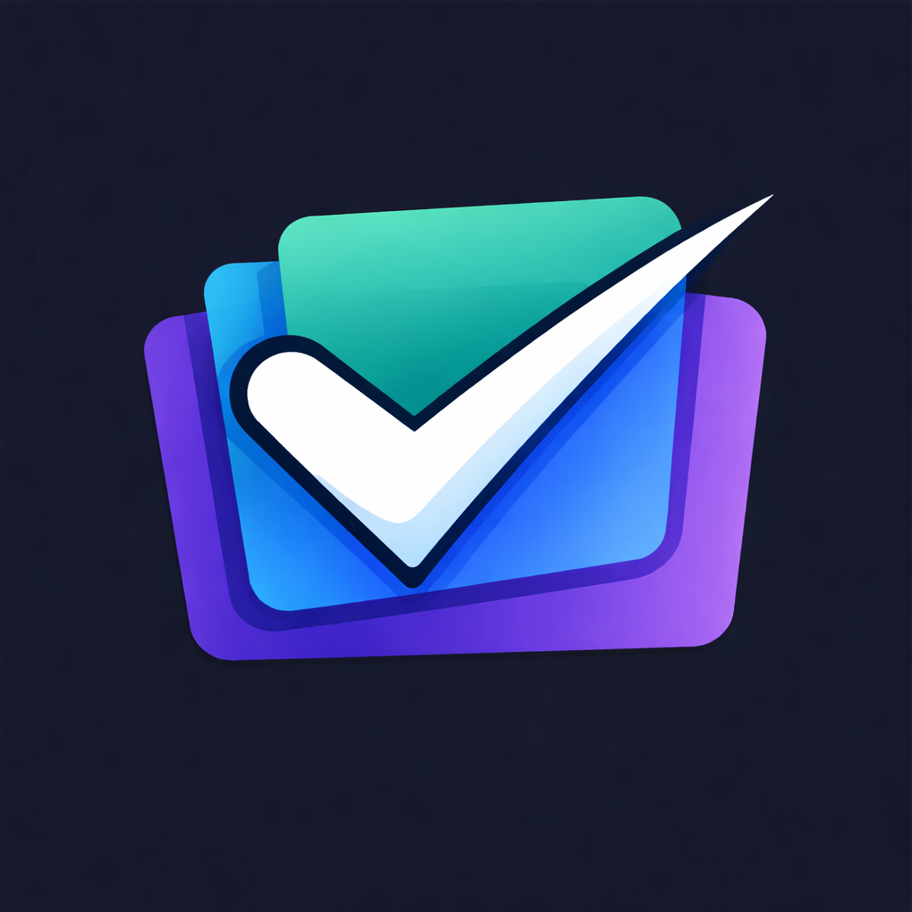

# SubZero - Subscription Manager & Tracker

<p align="center">
  
</p>

**SubZero** is a premium, offline-first subscription manager built with Flutter. It helps users track their recurring expenses, analyze spending habits, and get notified before bills are due. Designed with a stunning "Cyber Dark" and "Clean Light" theme, it offers a top-tier user experience.

---

## 🚀 Features

-   **Dashboard**: Visual summary of monthly spending and active subscriptions.
-   **Subscription Tracking**: Add, edit, and delete subscriptions with custom cycles (Monthly/Yearly).
-   **Analytics**: Interactive charts to visualize spending by category.
-   **Smart Notifications**: Get reminded 1 day before a bill is due.
-   **Multi-Currency**: Support for USD, EUR, GBP, JPY, and LKR.
-   **Theme Support**: Beautiful Dark and Light modes.
-   **Offline First**: All data is stored locally using Hive (NoSQL).
-   **Backup & Restore**: Save and load data from local files.
-   **AdMob Ready**: Integrated Banner Ads (easily toggleable).

---

## 🛠️ Installation

1.  **Unzip the Code**: Extract the downloaded zip file.
2.  **Open in IDE**: Open the project folder in VS Code or Android Studio.
3.  **Install Dependencies**:
    ```bash
    flutter pub get
    ```
4.  **Run the App**:
    ```bash
    flutter run
    ```

### Requirements
-   Flutter SDK: `^3.0.0`
-   Dart SDK: `^3.0.0`
-   Android Studio / Xcode (for mobile development)

---

## 🎨 Customization

### 1. Change App Name & Bundle ID
-   **Name**: Update `name` in `pubspec.yaml` and `android/app/src/main/AndroidManifest.xml`.
-   **Bundle ID**: Use `flutter_rename_app` package or manually update `build.gradle` and `Info.plist`.

### 2. Change Colors
-   Go to `lib/core/constants/app_colors.dart`.
-   Update `primaryAccent`, `lightPrimary`, etc. to your brand colors.

### 3. Change Strings (Localization)
-   All user-facing text is in `lib/core/constants/app_strings.dart`.
-   Edit this file to translate the app or change labels.

### 4. Enable/Disable Ads
-   Go to `lib/main.dart`, `dashboard_screen.dart`, and `settings_screen.dart`.
-   Uncomment the `BannerAdWidget` and initialization code to enable AdMob.

---

## 📂 Project Structure

```
lib/
├── core/
│   ├── constants/      # Colors, Strings, Templates
│   ├── services/       # Notifications, Backup, Ads
│   └── ui/             # Reusable widgets (GlassBox, etc.)
├── features/
│   ├── dashboard/      # Dashboard screen & widgets
│   ├── subscriptions/  # Add/Edit/List subscriptions
│   ├── settings/       # Settings screen & provider
│   ├── onboarding/     # Intro screens
│   └── notifications/  # Notification screen
└── main.dart           # App entry point
```

---

## 📦 Dependencies

-   `flutter_riverpod`: State management
-   `hive_flutter`: Local database
-   `fl_chart`: Charts and graphs
-   `flutter_local_notifications`: Local notifications
-   `google_mobile_ads`: AdMob integration
-   `glassmorphism`: UI effects

---

## 📞 Support

If you have any questions or need help with customization, please contact us via our CodeCanyon profile.

**Created with ❤️ by Stacklyn**
